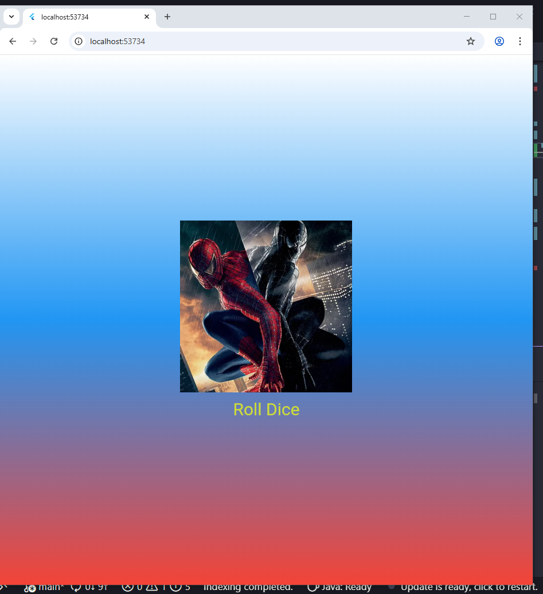

# Лабораторная работа №3. Flutter: структура UI и компонентный подход
## Выполнил работу:
 - **ФИО:** *Абдулин Ринат Рушанович*
 - **Группа:** *ИСП-233*
 - **Дата:** *25.05.26*
## Скриншот прриложения

---
## Ответы на вопросы:
### Зачем выносить виджеты в отдельные файлы? Что изменится если держать всё в main.dart?
    Вынос виджетов в отдельные файлы улучшает читаемость, переиспользуемость и тестируемость кода. Если всё держать в `main.dart`, файл быстро раздувается, становится трудно ориентироваться, сложнее переиспользовать виджеты в других местах, а изменения в любом виджете могут вызывать пересборку всего главного экрана.

### Что такое BuildContext? Почему метод build() принимает его как параметр?
`BuildContext` — это ссылка на местоположение виджета в дереве виджетов.
Метод `build()` принимает его как параметр, потому что виджету нужно знать своё окружение:
 - получать данные от родителей (через `InheritedWidget` — тема, размер экрана, локализация);
 - находить другие виджеты (например, по `GlobalKey`);
 - подписываться на обновления (чтобы перестроиться, когда данные изменятся).
Без контекста виджет был бы изолирован и не мог взаимодействовать с иерархией Flutter.

### Чем StatelessWidget отличается от StatefulWidget? Приведите пример когда нужен каждый из них.
`StatelessWidget` — виджет без внутреннего состояния: его параметры неизменны после создания. `StatefulWidget` — имеет изменяемое состояние, которое хранится в отдельном объекте `State` и может перестраивать виджет при вызове `setState()`.
Примеры:
 - `StatelessWidget` — кнопка с фиксированным текстом, иконка, элемент списка, который не меняется сам по себе.
 - `StatefulWidget` — поле ввода (`TextField`), таймер, счётчик кликов, анимация, чекбокс (реагирует на нажатие и меняет своё отображение).

### Почему Random() создаётся на уровне файла, а не внутри rollDice()?
    Создание `Random()` на уровне файла (или как статического поля) гарантирует, что генератор случайных чисел инициализируется один раз. Если создавать его внутри `rollDice()`, то при каждом броске будет создаваться новый экземпляр `Random`, который может давать менее случайную последовательность (особенно если вызовы частые), а также создавать лишние объекты, увеличивая нагрузку на сборщик мусора. Единый экземпляр `Random` обеспечивает равномерное распределение чисел за счёт сохранения внутреннего состояния между вызовами.
